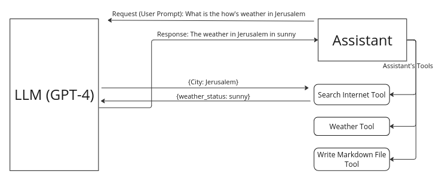

# CMND.ai Extension

## Concepts: 
- **LLM**: A type of AI, like ChatGPT, trained on vast amounts of text data to generate human-like responses based on text inputs.

- **Assistants**: Digital or virtual agents designed to assist users in performing a wide range of tasks via conversational interfaces. These assistants use an LLM as their core intelligence.

- **Tools**: Pre-defined functions or APIs that extend the capabilities of an LLM to perform specific tasks beyond its abilities.
- **RAG**: A technique that enhances Large Language Models by enabling them to access and utilize foundational knowledge.

- **Assistants With Tools**: Digital agents equipped with functionalities that LLMs alone cannot perform, such as accessing real-time data.

- **Assistants With RAG**: Digital agents equipped with the capability to acquire external knowledge and use it to enhance it's capabilites.
  

## Introduction

### Assistants:
computer programs that serve as virtual assistants and communicate with users through text-based interfaces on websites, social media platforms and messaging apps. These chatbots can assist customers, respond to inquiries or start a discussion with them. By equiping the asssitant with tools, the asssitant will be able to perform tasks that the LLM cannot do, and give it's result to the LLM to give you the final answer.

